# Aifya HMIS - Tab Architecture and Workflow Reference

**Document type:** Technical + operational reference
**System:** Aifya Hospital Management Information System
**Web application:** `apps/web` (Next.js, `http://localhost:3000`)
**API gateway:** `services/api-gateway` (FastAPI, `http://localhost:8000`)
**Database:** PostgreSQL 18.4, database `AIFYA-MAIN`
**Verification date:** 2026-09-29
**Facility under test:** mku hospital (`8f289f05-a5c3-487b-8684-3bf6931d1c4a`)

---

## 1. Verification Status

Every statement in this document was checked against the running system. Nothing here is inferred from design intent alone.

| Verification | Method | Result |
|---|---|---|
| All navigation tabs load | 201 GET routes swept across 36 modules | **201 reachable, 0 server errors (5xx)** |
| Registration workflow | 27 end-to-end assertions | **27 / 27 pass** |
| Finance workflow | 35 end-to-end assertions | **35 / 35 pass** |
| Reports workflow | 17 end-to-end assertions | **17 / 17 pass** |
| HR, Admin and Payroll | 60 end-to-end assertions | **60 / 60 pass** |
| Consultation to completion (clinical billing) | 31 assertions incl. settlement allocation | **31 / 31 pass** |
| Theatre workflow | 7 assertions incl. case numbering | **7 / 7 pass** |
| Aifya usage (hospital billing) | 37 live PostgreSQL bed-day and invoice assertions | **37 / 37 pass** |
| HR ledger vs Reports calculator | 16 live assertions: live-open month, rate change, finalized freeze | **16 / 16 pass** |
| Database migrations | `alembic current` vs `alembic heads` | **current = head = `038_aifya_usage_bed_invoice`** |
| Data integrity after testing | live row counts | **25 patients / 39 encounters - at baseline** |

**Errors encountered during the sweep that are correct behaviour, not defects**
- `422` on payroll, insurance, performance and referrals: missing required query parameters (`as_of_date`, `start`, `end`, `month`, `year`).
- `409` on duplicate department creation: unique-code constraint working as designed.
- `401` on any route without a token: authentication enforced.

---

## 2. Platform Architecture

### 2.1 Layers

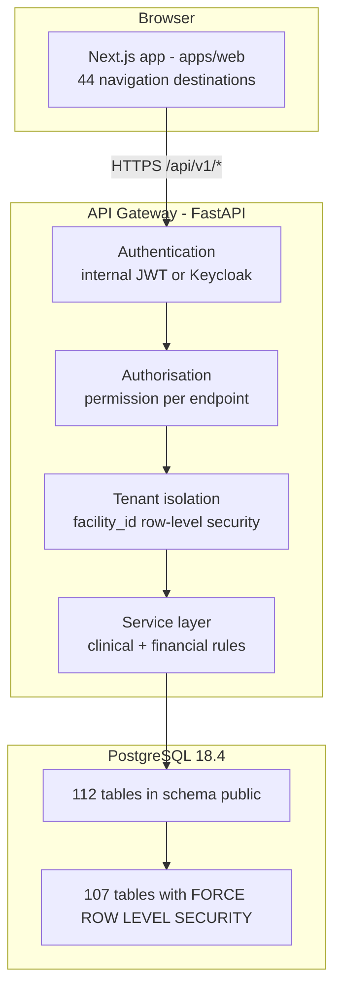

### 2.2 Request pipeline

Every API call passes through the same five gates:

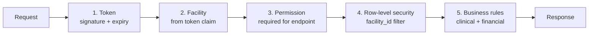

The facility is taken from the **token**, never from the request body. A facility can therefore never read or write another facility's data, even if a client sends a foreign identifier.

### 2.3 Authorisation model - two independent gates

A destination appears in the sidebar only when **both** gates pass:

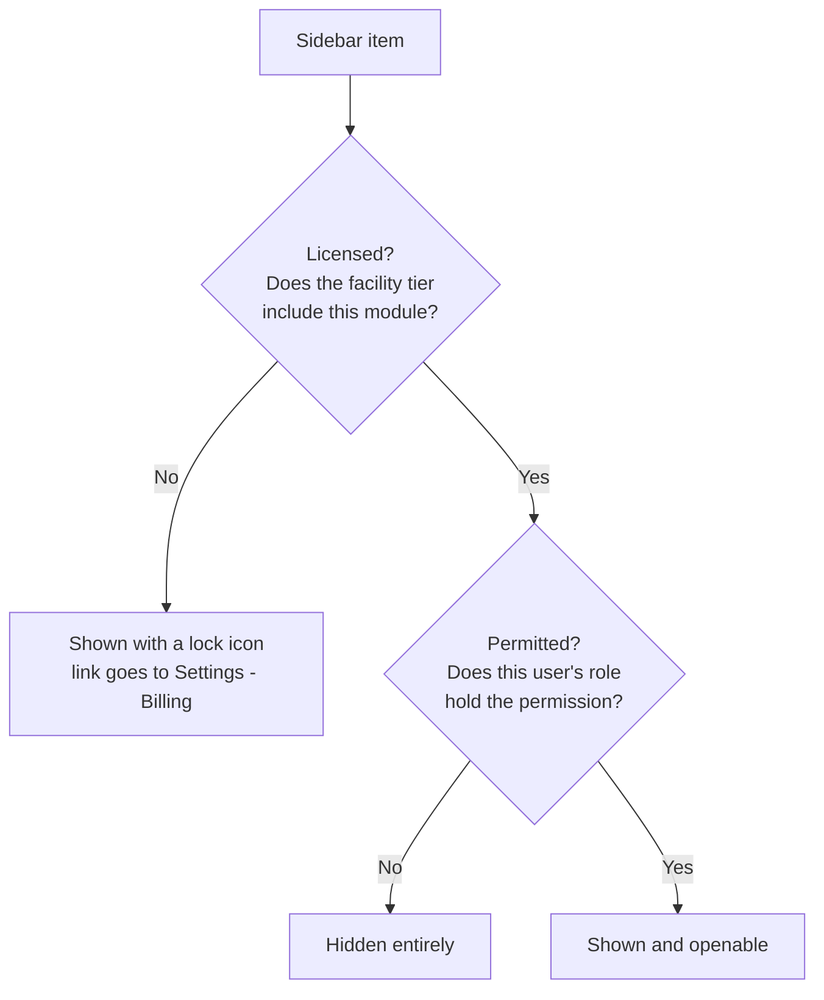

The license gate answers *"did the hospital buy this module?"*. The permission gate answers *"may this person use it?"*. The API enforces the permission again server-side, so hiding a link is a convenience, not the control.

### 2.4 Roles and their baselines

Roles are stored on the staff record. Aliases exist so a near-miss job title is still gated sensibly.

| Role (and aliases) | Scope |
|---|---|
| `super_admin`, `admin`, `facility_admin`, `hospital_administrator` | **All permissions.** Cannot be narrowed by an override row. |
| `receptionist`, `records`, `medical_records` | Registration, encounters, triage, OPD, appointments, billing + payment, insurance, referrals. **No `clinical.*`** - the front desk registers the visit but does not read the consultation. |
| `nurse`, `triage_nurse`, `ward_nurse` | Triage, vitals, clinical view, OPD, IPD, emergency, MCH, read-only lab/radiology/pharmacy. |
| `midwife` | Nursing baseline plus MCH record. |
| `doctor`, `clinician` | Clinical workspace, consultation, orders, IPD, emergency, dental view, referrals, reports. |
| `specialist` | Clinician baseline plus theatre view. |
| `dentist` | Clinician baseline plus dental record. |
| `lab_tech`, `pathologist` | Patients view, laboratory view and result only. |
| `rad_tech`, `radiologist` | Patients view, radiology view and result only. |
| `pharmacist` | Patients view, pharmacy view and dispense, inventory view, billing view. |
| `cashier`, `billing`, `billing_clerk` | Billing view, charge, payment, insurance, reports. |
| `billing_officer` | Cashier baseline plus reports view. |
| `finance_admin` | Billing, insurance, finance view and manage, inventory view, reports, analytics. |
| `hr`, `hr_admin`, `hr_officer` | HR view and manage, reports. |
| `store_keeper` | Inventory view and manage, pharmacy view. |
| `research_coordinator`, `principal_investigator` | Patients view, clinical view, trials, reports, analytics, communications. |
| `staff` / any unrecognised role | Patients view and knowledge only. Never empty, so an unclassified account still gets a working - if narrow - application. |

A facility may grant extra permissions to a role through an override row. Superuser roles sit outside that chain so an administrator can never lock themselves out.

---

## 3. Navigation Catalogue

All 44 destinations from the single navigation catalogue (`apps/web/src/lib/navigation.ts`). The catalogue is also the source for the command palette, so there is exactly one definition of "where can I go".

Every destination is answered by two gates: the permission in the last column, and the roles the destination belongs to in `apps/web/src/lib/navigation.ts`. The role is the key. A tab opens only for the role HR recorded on the staff member, and the state of duty declared at sign-in has to match that record before any workspace opens. An administrator is not a blanket exception: administrators own the back-office desks - HR, payroll, staff records, reports and the facility settings - and the clinical, pharmacy and finance desks stay with the roles that work them.

| # | Tab | URL | API base | Module gate | Permission |
|---|---|---|---|---|---|
| 1 | Dashboard | `/` | multiple | - | any signed-in user |
| 2 | Patients | `/patients` | `/api/v1/patients` | patients | `patients.view` |
| 3 | Registration | `/patients/register` | `/api/v1/patients`, `/api/v1/encounters` | patients | `patients.register` |
| 4 | Consultation Room | `/consultation` | `/api/v1/encounters` | encounters | `clinical.view` |
| 5 | Clinical | `/clinical` | `/api/v1/encounters/worklist` | encounters | `clinical.view` |
| 6 | OPD | `/opd` | `/api/v1/encounters/queue` | opd | `opd.view` |
| 7 | IPD | `/ipd` | `/api/v1/ipd` | ipd | `ipd.view` |
| 8 | Emergency | `/emergency` | `/api/v1/emergency` | emergency | `emergency.view` |
| 9 | Pharmacy | `/pharmacy` | `/api/v1/pharmacy` | pharmacy | `pharmacy.view` |
| 10 | Laboratory | `/laboratory` | `/api/v1/laboratory` | laboratory | `laboratory.view` |
| 11 | Radiology | `/radiology` | `/api/v1/radiology` | radiology | `radiology.view` |
| 12 | Theatre | `/theatre` | `/api/v1/theatre` | theatre | `theatre.view` |
| 13 | Dental | `/dental` | `/api/v1/dental` | dental | `dental.view` |
| 14 | MCH | `/mch` | `/api/v1/mch` | mch | `mch.view` |
| 15 | Billing | `/billing` | `/api/v1/billing` | billing | `billing.view` |
| 16 | Point of Sale | `/billing/pos` | `/api/v1/billing/pos/*` | billing | `billing.payment` |
| 17 | Finance | `/finance` | `/api/v1/finance` | finance | `finance.view` |
| 18 | Chart of Accounts | `/finance/accounts` | `/api/v1/finance` | finance | `finance.view` |
| 19 | GL Transactions | `/finance/transactions` | `/api/v1/finance` | finance | `finance.view` |
| 20 | Finance Reports | `/finance/reports` | `/api/v1/finance` | finance | `finance.view` |
| 21 | Budgets | `/finance/budgets` | `/api/v1/finance` | finance | `finance.view` |
| 22 | Fixed Assets | `/finance/assets` | `/api/v1/finance` | finance | `finance.view` |
| 23 | Periods | `/finance/periods` | `/api/v1/finance` | finance | `finance.view` |
| 24 | Reconciliation | `/finance/reconciliation` | `/api/v1/finance` | finance | `finance.view` |
| 25 | Insurance | `/insurance` | `/api/v1/insurance` | insurance | `insurance.view` |
| 26 | Inventory | `/inventory` | `/api/v1/inventory` | inventory | `inventory.view` |
| 27 | Appointments | `/appointments` | `/api/v1/appointments` | appointments | `appointments.view` |
| 28 | Referrals | `/referrals` | `/api/v1/referrals` | referrals | `referrals.view` |
| 29 | HR and Staff | `/hr` | `/api/v1/hr` | hr | `hr.view` |
| 30 | Payroll | `/hr/payroll` | `/api/v1/payroll` | hr | `hr.view` |
| 31 | Employees | `/hr/employees` | `/api/v1/payroll/employees` | hr | `hr.view` |
| 32 | Leave | `/hr/leave` | `/api/v1/payroll/leave*` | hr | `hr.view` |
| 33 | Payroll Reports | `/hr/payroll/reports` | `/api/v1/payroll` | hr | `hr.view` |
| 34 | Statutory Rates | `/hr/payroll/statutory` | `/api/v1/payroll/statutory*` | hr | `hr.view` |
| 35 | Aifya Usage | `/hr/aifya-usage` | `/api/v1/aifya-usage` | hr | `hr.view` |
| 36 | Reports | `/reports` | `/api/v1/reports` | reports | `reports.view` |
| 37 | Analytics | `/analytics` | `/api/v1/analytics` | analytics | `analytics.view` |
| 38 | Performance | `/performance` | `/api/v1/analytics`, `/api/v1/performance` | analytics | `analytics.view` |
| 39 | Communications | `/communications` | `/api/v1/communications` | communications | `communications.view` |
| 40 | Integrations (FHIR) | `/integrations/fhir` | `/api/v1/fhir`, `/api/v1/dhis2` | fhir | `settings.manage` |
| 41 | Clinical Trials | `/trials` | `/api/v1/trials` | clinical_trials | `trials.view` |
| 42 | Knowledge | `/knowledge` | `/api/v1/help` | knowledge | `knowledge.view` |
| 43 | User Guide | `/user-guide` | static | - | any signed-in user |
| 44 | Settings | `/settings` | `/api/v1/facility`, `/api/v1/hr`, `/api/v1/licensing` | - | `settings.manage` |

Additional API surfaces that back these tabs but are not separate destinations: `/api/v1/cds` (clinical decision support), `/api/v1/icd10` (diagnosis coding), `/api/v1/imaging`, `/api/v1/mpesa`, `/api/v1/agents`, `/api/v1/federated`, `/api/v1/onboarding`, `/api/v1/auth`, `/api/v1/laboratory`, `/api/v1/licensing`.

---

## 4. The Master Patient Journey

This is the end-to-end path the system is built around. Every tab is a station on this line.

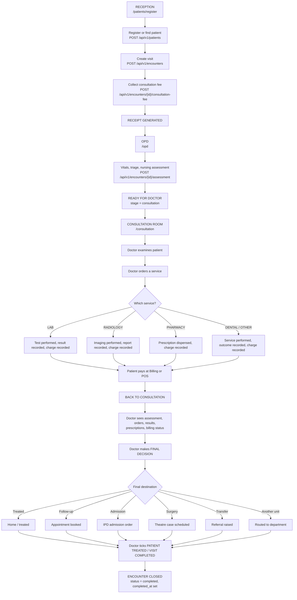

**The two hard rules embedded in this flow**

1. **Reception never chooses a department or a doctor.** The front desk creates the visit and routes it to the OPD queue. Clinical routing decisions belong to the clinician.
2. **A clinician's worklist is scoped by their department, not by a search box.** The system already knows who is signed in and which unit they belong to.
---

## 5. Front-Desk Tabs

### 5.1 Dashboard - `/`

**Who sees it:** every signed-in user.
**What it does:** role-aware home screen. It does not show one fixed dashboard; it renders the workspace most relevant to the signed-in role (reception sees registration activity, a clinician sees their queue, finance sees money).

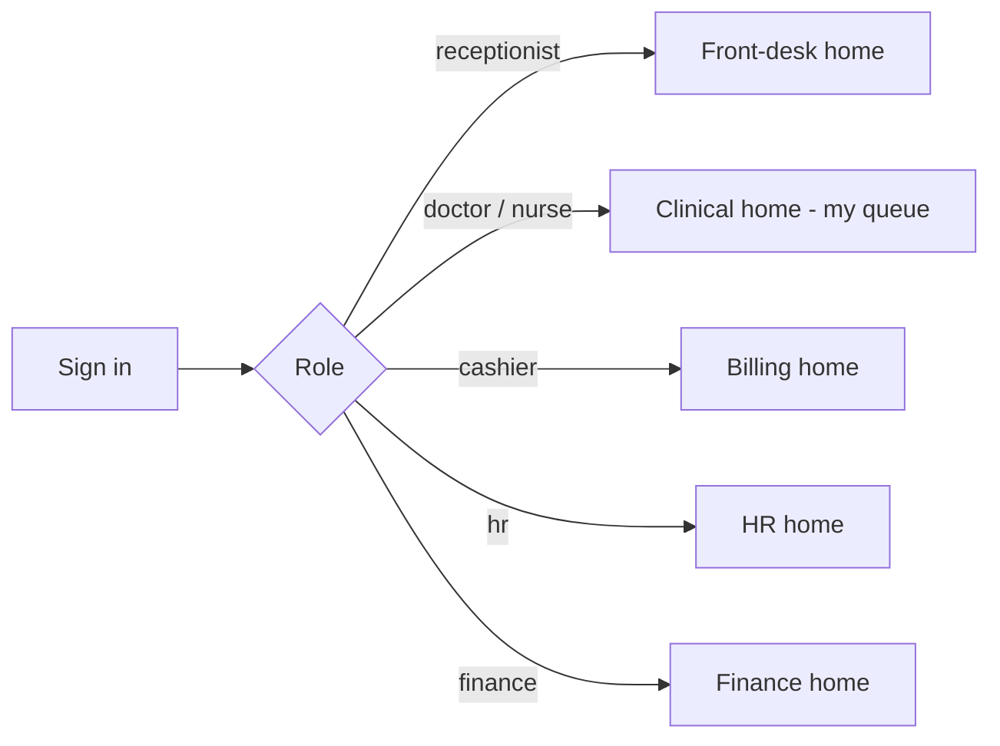

### 5.2 Patients - `/patients`

**Permission:** `patients.view`
**Purpose:** the master patient index - search, open a record, see visit history.

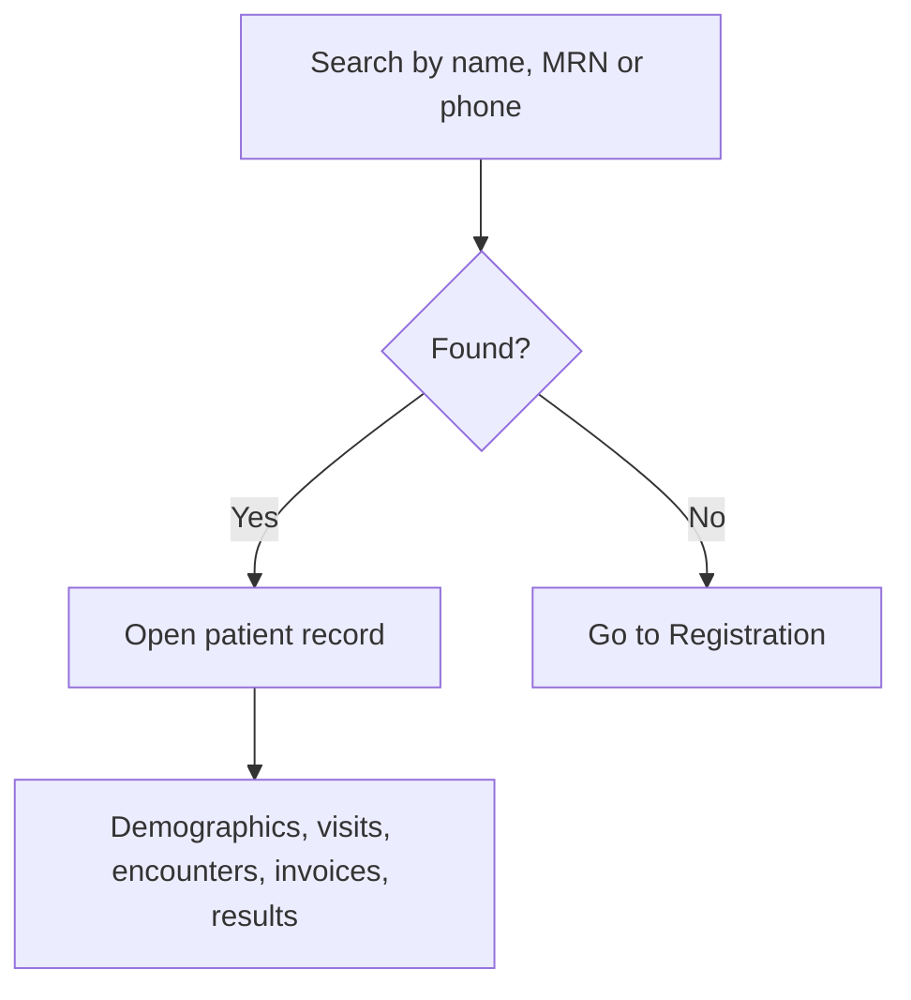

### 5.3 Registration - `/patients/register`

**Permission:** `patients.register`
**Purpose:** identify the patient and open the visit. This is the entry point of the master journey.

**Explicit design rule: reception does not choose a department and does not assign a doctor.** The form creates the patient and the encounter, takes the consultation fee, and places the patient in the OPD queue. Routing is a clinical decision made later.

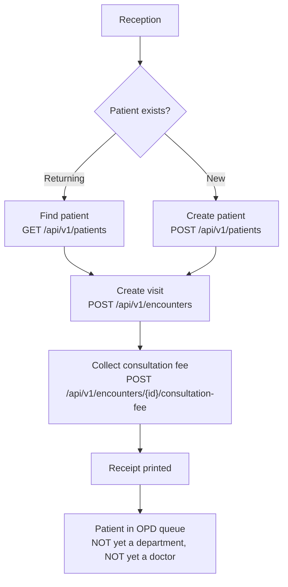

---

## 6. Clinical Tabs

### 6.1 Consultation Room - `/consultation`

**Permission:** `clinical.view` (consulting itself requires `clinical.consult`)
**Question it answers:** *"What is wrong with this patient, and where should they go?"*

The consultation room is the doctor's decision point. The doctor searches for a patient through the visits the patient has already passed through, reads the presenting problem and the OPD assessment, and decides the destination.

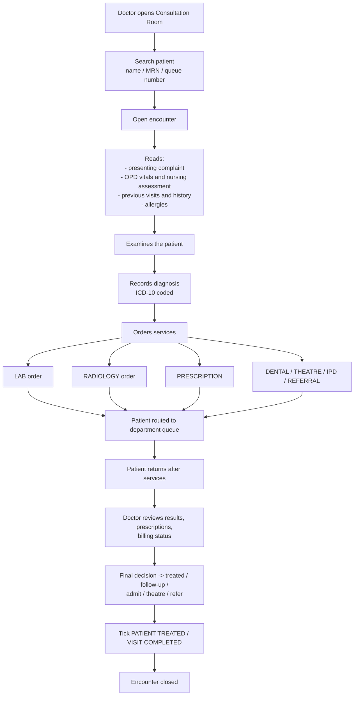

**Calling a patient in.** Two equivalent paths, both scoped to the doctor's own queue:

| Action | Endpoint | Behaviour |
|---|---|---|
| Call next | `POST /api/v1/encounters/queue/call-next` | Takes the next patient in triage-priority order. A doctor can never pull a patient waiting for a different unit. Administrators get the facility-wide queue. |
| Call a chosen patient | `POST /api/v1/encounters/{id}/call` | Brings a specific waiting patient into the room. Cannot exceed what "call next" would allow. |

### 6.2 Clinical - `/clinical`

**Permission:** `clinical.view`
**Endpoint:** `GET /api/v1/encounters/worklist`
**Question it answers:** *"These are the patients waiting for treatment in MY department."*

Clinical is **not** a second consultation room and **not** a general patient list. It is the receiving department's work queue and completion record. The department comes from the signed-in staff member's assignment - the doctor does not search for their own name.

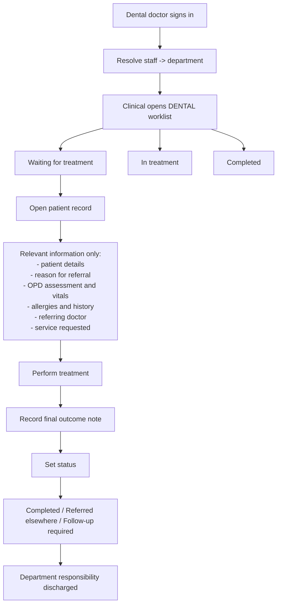

Worklist states:

| State | Meaning |
|---|---|
| Waiting | Routed to this department, not yet started |
| In treatment | Clinician has taken the patient |
| Completed | Department finished; outcome note recorded |
| Referred elsewhere | Handed to another unit |
| Follow-up required | Needs a return visit; an appointment can be booked |

**Scoping:** a worklist request is narrowed to the caller's department. A facility-wide worklist is refused unless the caller is an administrator, so a doctor cannot browse other departments' patients by omitting a filter.

### 6.3 OPD - `/opd`

**Permission:** `opd.view`
**Purpose:** the nursing station between reception and the doctor.

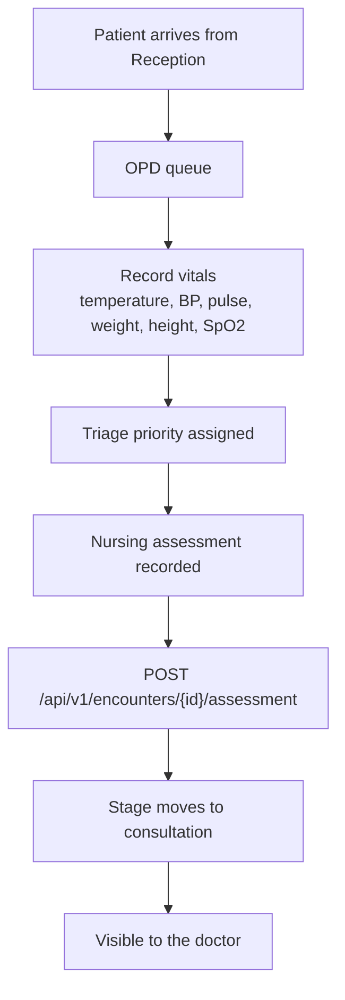

The queue is ordered by **triage priority first, then queue number**, so an emergency case does not wait behind routine visits.

### 6.4 IPD (Inpatient) - `/ipd`

**Permission:** `ipd.view`, recording requires `ipd.record`
**Purpose:** admissions, wards, beds, rounds and discharge.

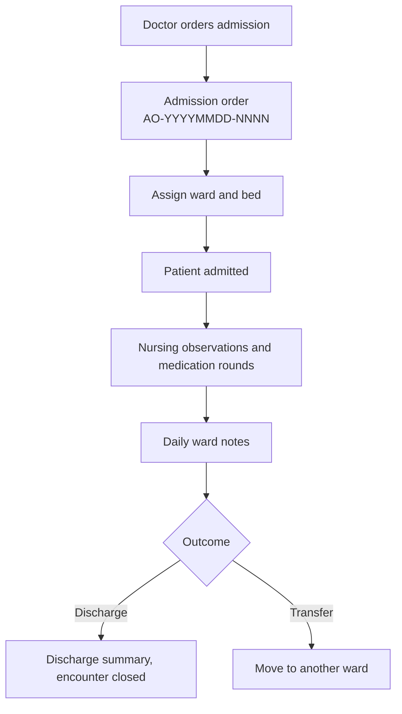

### 6.5 Emergency - `/emergency`

**Permission:** `emergency.view`, recording requires `emergency.record`
**Purpose:** triage-first casualty workflow. Emergency cases bypass the normal queue ordering.

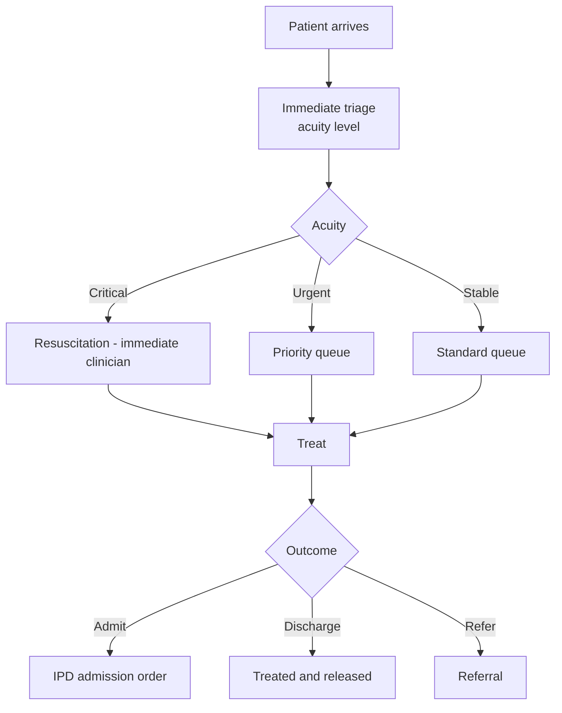

### 6.6 Dental - `/dental`

**Permission:** `dental.view`, recording requires `dental.record`
**Purpose:** the dental department's own clinical record. A dentist holds the clinician baseline plus dental record, so Dental opens as their working department.

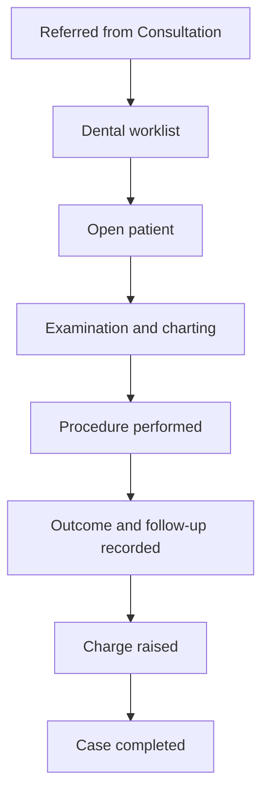

### 6.7 MCH (Maternal and Child Health) - `/mch`

**Permission:** `mch.view`, recording requires `mch.record`
**Purpose:** antenatal, postnatal, delivery and child welfare registers. A `midwife` role exists specifically for this.

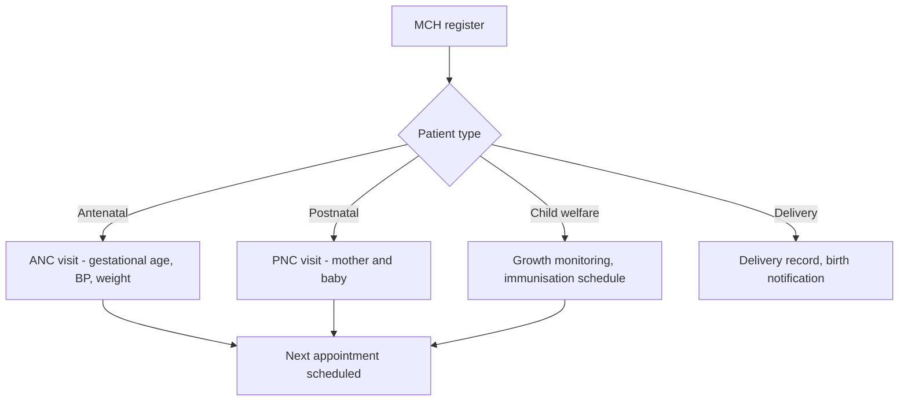

### 6.8 Theatre - `/theatre`

**Permission:** `theatre.view`, recording requires `theatre.record`
**Purpose:** operating theatre scheduling and the operative record.

**Case numbering rule:** the next case number is derived from the **highest number already issued that day, including soft-deleted cases**. A deleted case does not free its number for reuse, which is what prevents the duplicate-key failure that a naive count-based generator produces.

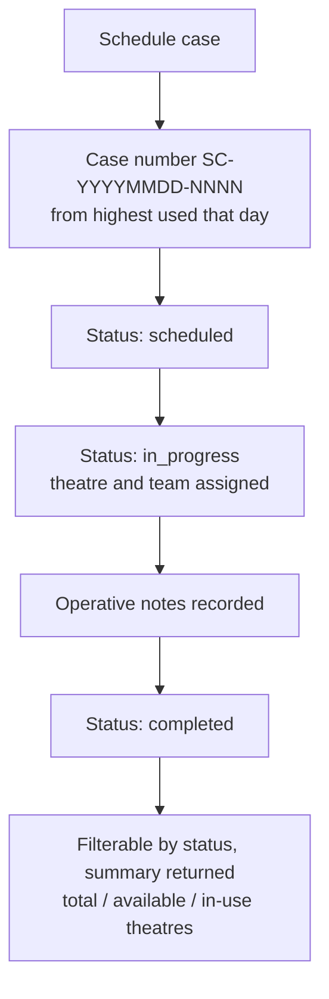

---

## 7. Diagnostic and Therapy Departments

### 7.1 Pharmacy - `/pharmacy`

**Permission:** `pharmacy.view`, dispensing requires `pharmacy.dispense`

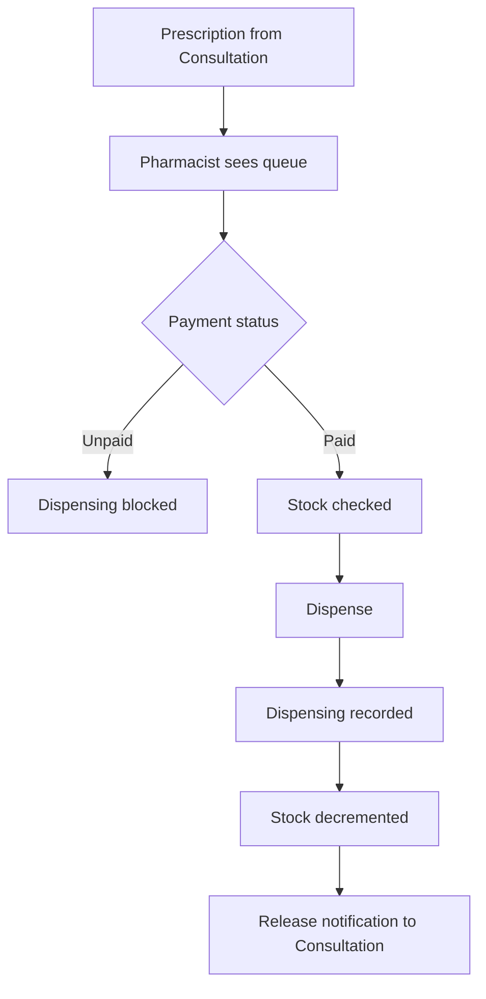

The payment gate is deliberate: a prescription whose charge is unpaid does not release, and paying a different service does not release it.

### 7.2 Laboratory - `/laboratory`

**Permission:** `laboratory.view`, entering results requires `laboratory.result`

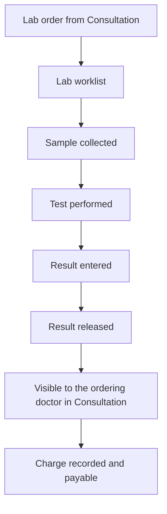

### 7.3 Radiology - `/radiology`

**Permission:** `radiology.view`, reporting requires `radiology.result`

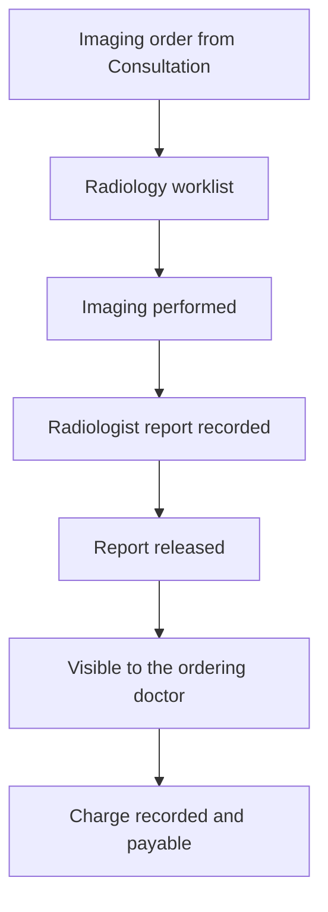

### 7.4 Inventory - `/inventory`

**Permission:** `inventory.view`, managing requires `inventory.manage`
**Purpose:** the store behind Pharmacy. Items, stock levels, batches, expiry dates, receipts and issues. `store_keeper` owns this; Pharmacy reads it so dispensing can decrement stock.

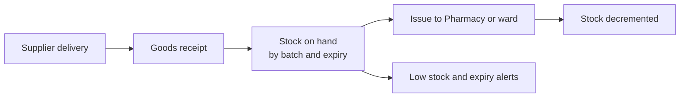
---

## 8. Money Tabs

### 8.1 The charge-to-cash pipeline

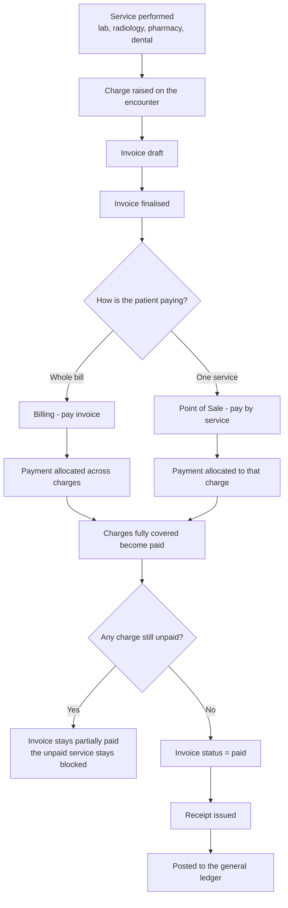

### 8.2 Billing - `/billing`

**Permission:** `billing.view`

| Action | Endpoint |
|---|---|
| Billing summary | `GET /api/v1/billing/summary` |
| List invoices | `GET /api/v1/billing/invoices` |
| Create invoice | `POST /api/v1/billing/invoices` |
| Invoice detail | `GET /api/v1/billing/invoices/{id}` |
| Finalise invoice | `POST /api/v1/billing/invoices/{id}/finalize` |
| Record payment | `POST /api/v1/billing/invoices/{id}/pay` |
| Waive invoice | `POST /api/v1/billing/invoices/{id}/waive` |
| Invoice receipt | `GET /api/v1/billing/invoices/{id}/receipt` |

### 8.3 Point of Sale - `/billing/pos`

**Permission:** `billing.payment`
**Purpose:** the cashier's counter. Charging and collecting per service, at the point the patient is standing there.

| Action | Endpoint |
|---|---|
| Charges for an encounter | `GET /api/v1/billing/pos/encounters/{id}/charges` |
| Charges for a patient | `GET /api/v1/billing/pos/patients/{id}/charges` |
| Collect payment | `POST /api/v1/billing/pos/encounters/{id}/pay` |
| Service receipt | `GET /api/v1/billing/pos/payments/{id}/receipt` |

### 8.4 The settlement allocation rule

When a cashier takes a payment against an outstanding bill **without naming a service**, the payment must be spread across **all** outstanding charges until the money runs out. Each charge receives its corresponding allocation and flips to paid when fully covered.

```mermaid
flowchart TD
    A["Payment received: 1,718"] --> B["Load all outstanding charges<br/>oldest first"]
    B --> C["Allocate to charge 1: Lab 200"]
    C --> D["Allocate to charge 2: Pharmacy 18"]
    D --> E["Allocate to charge 3: Radiology 1,500"]
    E --> F["Payment exhausted: 200 + 18 + 1,500 = 1,718"]
    F --> G["Every covered charge -> paid"]
    G --> H["Invoice paid = sum of allocations"]
    H --> I["Invoice balance = total - paid"]
    I --> J{"Any charge still unpaid?"}
    J -->|Yes| K["Invoice MUST NOT read paid"]
    J -->|No| L["Invoice reads paid"]
```

**Three invariants the system enforces**

1. **Sum of allocations equals the payment amount.** No money is created or lost.
2. **Invoice `paid` equals the sum of its charge allocations**, and `balance` equals `total - paid`.
3. **An invoice can never read `paid` while any underlying charge is unpaid.** A partially covered bill reads partially paid regardless of how the invoice-level arithmetic looks.

**Idempotency.** Replaying the identical payment request (a network retry, or an impatient double-click) must not duplicate the money. Verified behaviour: three identical retries produce **one payment and three allocations** - not three payments.

### 8.5 Finance - `/finance` and its sub-tabs

**Permission:** `finance.view`, posting requires `finance.manage`

| Sub-tab | URL | Purpose |
|---|---|---|
| Finance | `/finance` | Financial overview |
| Chart of Accounts | `/finance/accounts` | The account tree |
| GL Transactions | `/finance/transactions` | Journal entries; transaction reversal |
| Finance Reports | `/finance/reports` | Trial balance, income statement, balance sheet |
| Budgets | `/finance/budgets` | Budget vs actual |
| Fixed Assets | `/finance/assets` | Asset register and depreciation |
| Periods | `/finance/periods` | Accounting period open and close |
| Reconciliation | `/finance/reconciliation` | Bank and cash reconciliation |

```mermaid
flowchart TD
    A["Patient payment collected"] --> B["Automatic journal entry"]
    B --> C["General ledger"]
    C --> D["Transaction list /finance/transactions"]
    D --> E["Trial balance and statements /finance/reports"]
    C --> F["Reconciliation /finance/reconciliation"]
    C --> G["Period close /finance/periods"]
```

An opening balance is **unique per account**: a second opening balance for the same account is rejected with `409 Conflict`, not a server error.

### 8.6 Insurance - `/insurance`

**Permission:** `insurance.view`, managing requires `insurance.manage`
**Purpose:** schemes, members, eligibility, pre-authorisation and claim tracking. The front desk and the cashier both hold this permission so a patient can be verified before treatment.

```mermaid
flowchart LR
    A["Patient presents cover"] --> B["Verify member and eligibility"]
    B --> C["Pre-authorisation if required"]
    C --> D["Service performed"]
    D --> E["Claim raised"]
    E --> F["Submitted, tracked, settled"]
```

---

## 9. Administration and Insight Tabs

### 9.1 Appointments - `/appointments`

Booking, rescheduling and cancellation. Appointment reminders flow through Communications.

```mermaid
flowchart LR
    A["Book"] --> B["Scheduled"]
    B --> C{"Patient arrives?"}
    C -->|Yes| D["Checked in -> creates the visit"]
    C -->|No| E["Marked no-show"]
    B --> F["Reschedule or cancel"]
```

### 9.2 Referrals - `/referrals`

Outbound and inbound referrals. Numbered `REF-YYYYMMDD-NNNN`.

```mermaid
flowchart TD
    A["Doctor decides referral"] --> B["Referral raised<br/>REF-YYYYMMDD-NNNN"]
    B --> C["Reason, destination, urgency"]
    C --> D["Patient referred"]
    D --> E["Referral tracked to outcome"]
```

### 9.3 HR and Staff - `/hr`

**Permission:** `hr.view`, changes require `hr.manage`

```mermaid
flowchart TD
    A["HR tab"] --> B["Staff directory<br/>filter by department"]
    B --> C["Employees - /hr/employees"]
    B --> D["Leave - /hr/leave"]
    B --> E["Payroll - /hr/payroll"]
    E --> F["Payroll Reports - /hr/payroll/reports"]
    E --> G["Statutory Rates - /hr/payroll/statutory"]
```

### 9.4 Payroll - `/hr/payroll`

**Permission:** `hr.view`
**Purpose:** pay runs, payslips and statutory deductions.

```mermaid
flowchart TD
    A["Employees on file"] --> B["Create payroll run for a month"]
    B --> C["Exactly one live draft per month<br/>a second run retires the earlier draft"]
    C --> D["Gross pay from salary and attendance"]
    D --> E["Statutory deductions<br/>PAYE, NSSF, NHIF/SHIF, housing levy"]
    E --> F["Net pay"]
    F --> G["Payslips generated"]
    G --> H["Posted to finance"]
```

**Leave.** Leave requests, balances and attendance feed the pay run. A leave balance request for an account with no payroll employee record returns `400` - the record does not exist, which is correct rather than a defect.

### 9.5 The employee-to-staff bridge

There is a database trigger, `sync_employee_to_staff()`, that mirrors a row created in the employee table into the staff table, so an employee added once appears as a staff member without being entered twice.

### 9.6 Reports - `/reports`

**Permission:** `reports.view`
Clinical, operational and financial report packs. Date-bounded: a report without its required `as_of_date` or date range returns `422`, by design.

### 9.7 Analytics and Performance

**Permission:** `analytics.view`
Analytics covers trends and aggregates; Performance covers service-level and turnaround measures. Both read the same analytics module.

### 9.8 Communications - `/communications`

**Permission:** `communications.view`
Outbound messaging to patients - SMS, WhatsApp and email channels - plus a send history.

### 9.9 Integrations - `/integrations/fhir`

**Permission:** `settings.manage`
**Module:** fhir
FHIR and DHIS2 interoperability surfaces for exchanging data with national and external systems. Additional integration surfaces exist for imaging, M-Pesa payments and federated queries.

### 9.10 Clinical Trials - `/trials`

**Permission:** `trials.view`
**Module:** clinical_trials
Study and protocol registry, participant enrolment and trial data capture.

### 9.11 Knowledge - `/knowledge` and User Guide - `/user-guide`

An in-app assistant and the written guide. Both are available to every role - `knowledge.view` is present in every baseline permission set on purpose, so no role is locked out of help.

### 9.12 Settings - `/settings`

**Permission:** `settings.manage`

| Sub-page | Purpose |
|---|---|
| `/settings/facility` | Facility profile - name, code, level, MFL code, location, contacts, currency, timezone |
| `/settings/team` | Staff and their roles |
| `/settings/roles` | Permission overrides per role |
| `/settings/billing` | License tier and module entitlements |
| `/settings/appearance` | Theme |
| `/settings/language` | English / Swahili |

**Note on the facility form.** `PATCH /api/v1/facility` is a working endpoint. A `422` from it means the form submitted invalid input, and the response names the offending field:

| Input | Result |
|---|---|
| Blank `name` | `422` - "name cannot be blank" |
| `facility_type` longer than 50 characters | `422` - "String should have at most 50 characters" |
| Blank optional fields (address, lat/long, email, website) | `200` - blank means "clear this field" |
| Full form payload as the UI submits it | `200` |

### 9.13 Aifya Usage (hospital billing) - `/hr/aifya-usage`

**Permission:** `hr.view` to read; `hr.manage` to change the rate, recompute a range, raise or settle an invoice; an administrator to close a month or void an invoice.
**Purpose:** what the hospital owes Aifya - a ledger and an invoice kept entirely separate from patient billing.

Aifya charges the facility, not the patient, for **patient-days** of use. One patient on one calendar day is one patient-day, priced at the facility's rate. A patient who is in a ward that day is counted for every day of the stay.

Where a day's usage comes from:

- **Encounters.** An `emergency` encounter marks the patient as an Emergency arrival; every other type is a Registration arrival. `cancelled` and soft-deleted encounters are ignored.
- **Admissions.** A patient occupies a bed on every calendar day from `admitted_at` to `discharged_at`, **both days inclusive**, or to today while still admitted. A four-day stay is therefore four patient-days even when only one encounter was recorded.

```mermaid
flowchart TD
    A["Encounters recorded that day"] --> B{"Encounter type<br/>is emergency?"}
    B -->|No| C["Registration arrival"]
    B -->|Yes| D["Emergency arrival"]
    E["Bed occupied that day<br/>admitted_at .. discharged_at inclusive"] --> F["Inpatient"]
    C --> G["Merge to one row per patient per day"]
    D --> G
    F --> G
    G --> H{"Priority<br/>Inpatient > Emergency > Registration"}
    H --> I["Total billable patients for the day"]
    I --> J["x rate per patient-day"]
    J --> K["Daily amount"]
    K --> L["Month = sum of every day"]
    L --> M["Draft invoice AIU-YYYYMM-NNNN"]
    M --> N["Issued: due in 30 days"]
    N --> O{"Settled in full?"}
    O -->|Yes| P["Paid"]
    O -->|No| Q["Issued, balance outstanding"]
    M --> R["Void, while no money recorded"]
```

Rules the calculation enforces:

- **A patient is counted once per day.** The three channels partition the daily total rather than overlapping it, so `registration + emergency + inpatient` always equals that day's total. A patient with an encounter **and** a bed counts once, as Inpatient.
- **Admission day and discharge day both count.** A same-day admit-and-discharge is one patient-day.
- **An open admission counts up to the end of the requested range**, and never past today.
- **`cancelled` encounters, soft-deleted encounters and soft-deleted admissions do not count.**
- **The day boundary is the hospital's midnight**, read from the facility timezone, not the server's.
- **Nothing here touches a patient invoice.**

| Action | Endpoint |
|---|---|
| Read the rate | `GET /api/v1/aifya-usage/config` |
| Change the rate | `PUT /api/v1/aifya-usage/config` |
| Compute or refresh a range | `POST /api/v1/aifya-usage/accrue` |
| Read the stored ledger | `GET /api/v1/aifya-usage/daily?start&end` |
| The month's bill (live while the month is open, frozen once closed) | `GET /api/v1/aifya-usage/summary?year&month` |
| Close a month (raises the draft invoice) | `POST /api/v1/aifya-usage/finalize` |
| List invoices | `GET /api/v1/aifya-usage/invoices` |
| Raise or refresh an invoice | `POST /api/v1/aifya-usage/invoices` |
| One invoice | `GET /api/v1/aifya-usage/invoices/{id}` |
| Issue an invoice | `POST /api/v1/aifya-usage/invoices/{id}/issue` |
| Record money received | `POST /api/v1/aifya-usage/invoices/{id}/payment` |
| Void an unpaid invoice | `POST /api/v1/aifya-usage/invoices/{id}/void` |

Recomputing is idempotent: the same encounters and admissions always produce the same figures, so the ledger can be refreshed as often as needed. Raising an invoice is idempotent while it is a draft.

**Closing a month freezes it.** Closing meters the month first, so even a month nobody accrued has days to freeze and to raise the invoice from. Each day then stores the rate it was priced at, so a later rate change cannot restate a bill already issued. Recomputing a closed month is refused unless the caller explicitly forces it.

**Invoice lifecycle: `draft -> issued -> paid`, with `void` while no money has been recorded.** The invoice flips to `paid` only when payments cover it in full; a partial settlement leaves it `issued` with a visible balance. A voided invoice does not block a replacement for the same month, and the next number is taken from the highest number already used in the period - including voided and soft-deleted rows - so a number is never reused.

**Rate confirmation.** The built-in default is KES 20 per patient-day, and `is_configured = false` until an administrator saves a rate, so a placeholder can never be mistaken for a contracted figure. Both the API and the screen carry that flag.

**One figure, two screens.** This screen and the Reports calculator at `/reports/usage-billing` both read one month view, so the two tabs cannot quote different usage for the same month. An **open** month is metered live on both - nobody has to run an accrual first - and a **closed** month is read from the frozen ledger on both, so the figure an invoice was already raised on cannot drift. The calculator's rate defaults to the rate configured here - an empty rate box means "the rate this facility is billed at" - and typing a rate overrides it for that one what-if run only.

Before this was unified, the calculator metered Reception and Emergency independently and charged a patient who passed through both doors twice, and it charged each admission *record* separately rather than each patient-day. On September 2026 that inflated the month from 107 to 109 patient-days: two patients each had two live admission rows covering one of the same days, and each was charged for that day twice.

| Action | Endpoint |
|---|---|
| The month's charge, priced | `GET /api/v1/reports/usage-billing?month&rate_cents` |
| The rolling months | `GET /api/v1/reports/usage-billing/monthly?months&end_month&rate_cents` |

**One bed-day per patient per day.** A patient counts once for a calendar day even when the records hold more than one - or a pair of overlapping - admission rows covering it, because that is what "patient-day" means.

**Rate changes.** An open month re-prices at once on both screens, because both price the days at the rate configured here. A closed month keeps the rate each stored day was priced at, so raising the rate can never restate a bill already issued. The quantity of patient-days is never affected by the rate.

---

## 10. Database and Environment

### 10.1 What the application actually connects to

| Item | Real value |
|---|---|
| Configuration file used | `services/api-gateway/.env`, line 2 |
| Effective connection | `postgresql+asyncpg://aifya_user:<password>@localhost:5432/AIFYA-MAIN` |
| Server | Native Windows PostgreSQL **18.4**, port 5432 |
| Database | `AIFYA-MAIN` - 112 tables in schema `public` |
| Runtime login | `aifya_user` - NOSUPERUSER, NOBYPASSRLS, owns 112 tables |
| Row-level security | 107 tables with ENABLE + FORCE |
| Migrations | Fully applied - current and head both `036_rls_aware_backfills` |
| Redis | `redis://localhost:6379/0` - **not currently running** |
| Kafka | `localhost:9092` - **not currently running** |
| Object storage | MinIO on `localhost:9000` |

The API does not connect to Redis or Kafka during startup, which is why all 196 routes answer correctly while those services are down. They are required by background and asynchronous features, not by the request path.

### 10.2 Connection precedence

```mermaid
flowchart TD
    A["Application start"] --> B{"DATABASE_URL set?"}
    B -->|Yes| C["Use DATABASE_URL"]
    B -->|No| D["Use the built-in default"]
    C --> E["Startup validation rejects known placeholder values"]
    D --> E
    E -->|Placeholder found| F["Refuse to start"]
    E -->|Real value| G["Connect"]
```

**`DATABASE_URL` is the only variable that controls the database.** The `DB_HOST`, `DB_PORT`, `DB_NAME`, `DB_USER` and `DB_PASSWORD` entries further down the same file are **not read by any code** - they are inert, and they contradict reality (`DB_NAME=postgres`, `DB_USER=app_user`). Editing them changes nothing. They should be deleted to remove the trap.

### 10.3 Tenant isolation is transaction-scoped

The current facility is set as a **transaction-local** setting. This has one operational consequence that has already caused a real bug in this codebase: **a mid-request commit clears the facility context**, so any code that commits partway through a request and then continues reading will silently see nothing. The request dependency commits once, at the end.

---

## 11. Departments - Where They Live

Departments are the units a patient can be routed to and the cost centres payroll groups by. They are **not** created from the Registration tab and not from the Consultation Room.

| Operation | Endpoint | Who may do it |
|---|---|---|
| List departments | `GET /api/v1/payroll/departments` | any signed-in user |
| **Create a department** | `POST /api/v1/payroll/departments` | `admin`, `facility_admin`, `hr_admin` |
| List departments for routing | `GET /api/v1/encounters/departments` | any signed-in user |

A department's code is unique **across soft-deleted rows too**. Creating a department whose code matches a previously deleted one **revives** the deleted record rather than raising a duplicate-key error. Attempting to create a genuinely duplicate live code returns `409 Conflict`.

---

## 12. Open Items

Recorded honestly. None of these are silently broken; each is a known state.

| # | Item | Status |
|---|---|---|
| 1 | **Database target not yet decided.** The application points at the local `AIFYA-MAIN`. If the intention is to move to a production or remote database, only `DATABASE_URL` needs to change, followed by an API restart. | Awaiting decision |
| 2 | **`DB_*` variables are dead configuration** and contradict the live values. They should be removed. | Not yet done |
| 3 | **The Alembic CLI does not read `.env`.** `alembic current` and `alembic upgrade` require `DATABASE_URL` to be exported in the shell first; otherwise they fall back to the Docker host `postgres:5432`, which does not resolve on this machine. | Not yet done |
| 4 | **Redis and Kafka are not running.** The request path is unaffected; asynchronous features are. | Not yet done |
| 5 | **Root `.env` line 12 is a non-functional template** - it contains unexpanded `${...}` shell syntax. The API never reads this file. | Informational |
| 6 | **`aifya_user` owns the 112 tables it serves traffic with.** RLS protection rests on FORCE RLS alone. `scripts/harden-db-roles.sql` contains a plan to create a separate non-owner role, but it has not been applied. | Not yet done |
| 7 | **Aifya usage billing is implemented** - patient-days metered from encounters (Registration/Emergency) and from admissions (ward bed-days, admission and discharge inclusive), deduplicated per patient per day, with a full invoice lifecycle (draft -> issued -> paid/void) at `/hr/aifya-usage`. The Reports calculator reads the same ledger, so both tabs quote one figure. The built-in rate is a placeholder until confirmed. | **Built** |
| 8 | **Multi-service receipt itemisation.** A bill-wide payment allocates correctly across all charges, but the printed receipt lists only the last allocation rather than every service covered. This is a documentation gap, not a payment gap. | Open |

---

## 13. Appendix - Evidence Log

| Suite | Coverage | Result |
|---|---|---|
| Route sweep | 201 GET routes, 36 modules | 201 reachable, 0 x 5xx, 197 x 2xx, 4 x expected 4xx |
| Registration | 27 assertions | 27 / 27 |
| Finance | 35 assertions | 35 / 35 |
| Reports | 17 assertions | 17 / 17 |
| HR, Admin and Payroll | 60 assertions | 60 / 60 |
| Clinical and billing regression | 31 assertions, incl. settlement invariants | 31 / 31 |
| Theatre | 7 assertions, incl. case numbering after soft delete | 7 / 7 |
| Aifya usage billing | 40 assertions, incl. per-day dedup, idempotency, month freeze, permissions and patient-billing isolation | 40 / 40 |
| Aifya usage bed-days and invoices | 37 assertions live on PostgreSQL, incl. 4-day stay = 4 bed-days, discharge day inclusive, channel partition, invoice lifecycle, void-then-replace numbering, idempotency, permissions and patient-billing isolation | 37 / 37 |
| Aifya usage rule is portable | The rewritten rule reproduced the previous SQL figure exactly (September 2026 and the March 2025 probe suite) | match |
| Ledger vs Reports calculator | Quantities, amounts and the configured rate agree on live data for September 2026 | match |

Data left at baseline after testing: **25 live patients, 39 live encounters.** No probe rows retained.
